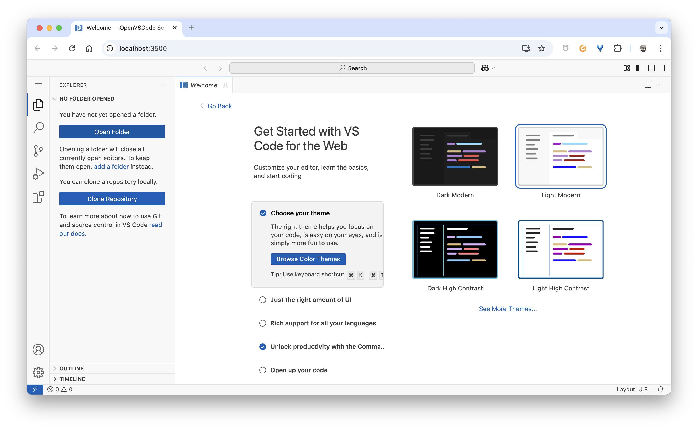
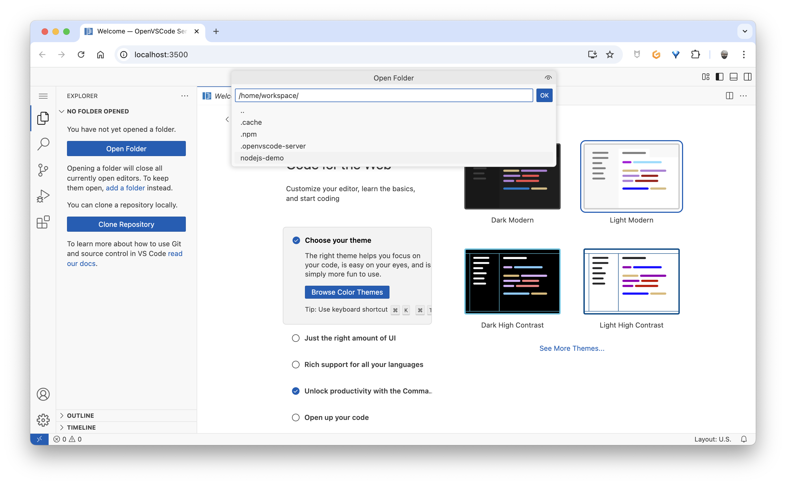
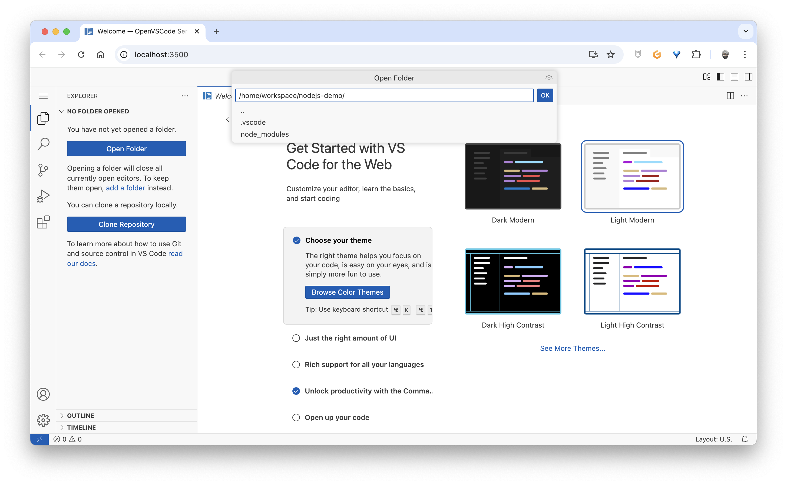
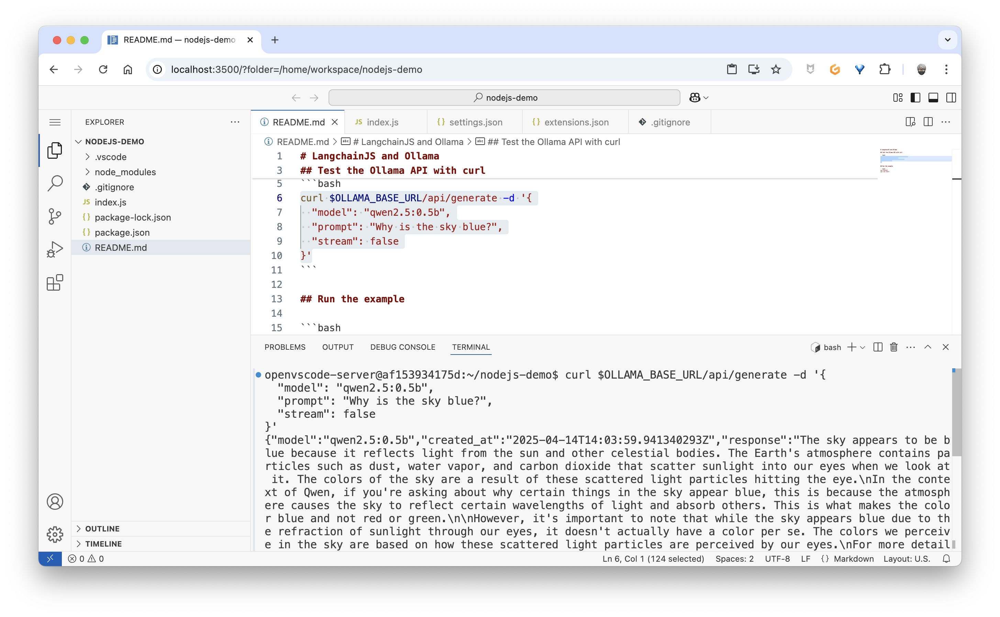
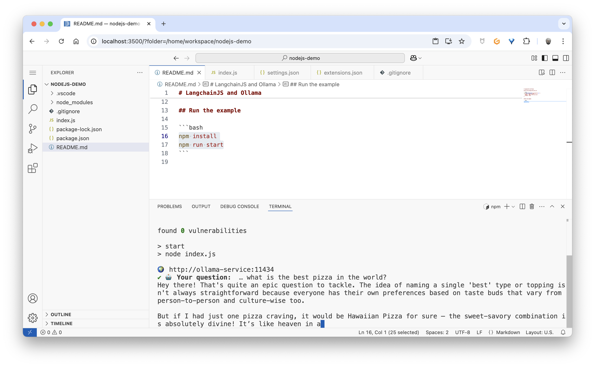
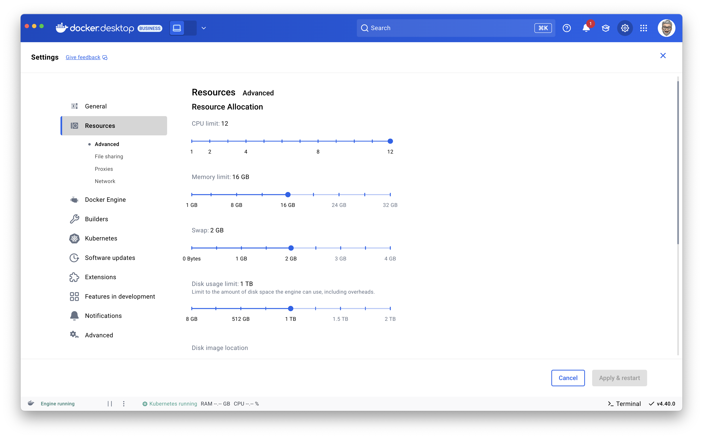

# 🦙 Ollama POC

## If you work on workstation on Windows or Linux with GPU

```bash
docker compose --file compose.gpu.yml up --build
```
> - Tested on Docker Cloud

## If you work on workstation on Windows or Linux without GPU or on MacOS

```bash
docker compose --file compose.no-gpu.yml up --build
```
> - Tested on macOS

## Be patient ⏳

## Then

Open http://localhost:3500/

Once the Web IDE loaded, click on the "Open Folder" button:


Select `nodejs-demo` folder:


Click on the "OK" button:


You can test the Ollama API with curl:


You can run the Langchain JS example:



## Remarks

I downladed 3 models:
- `qwen2.5:0.5b`
- `qwen2.5:1.5b`
- `qwen2.5:3b`

Depending on your GPU (or CPU), you can choose the model you want to use in the `index.js` file:
```javascript
const llm = new ChatOllama({
  model: "qwen2.5:3b",
  baseUrl: process.env.OLLAMA_BASE_URL || "http://ollama-service:11434",
  temperature: 0.5,
  repeatPenalty: 2.2,
})
```

## Troubleshooting

If you get the following error:
```bash
{"error":"model requires more system memory (2.7 GiB) than is available (1.6 GiB)"
```
You need to increase the memory of your Docker Desktop:
